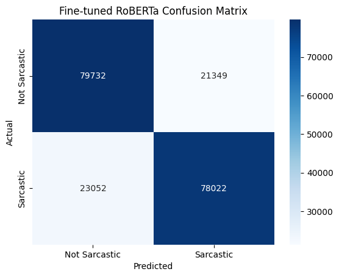
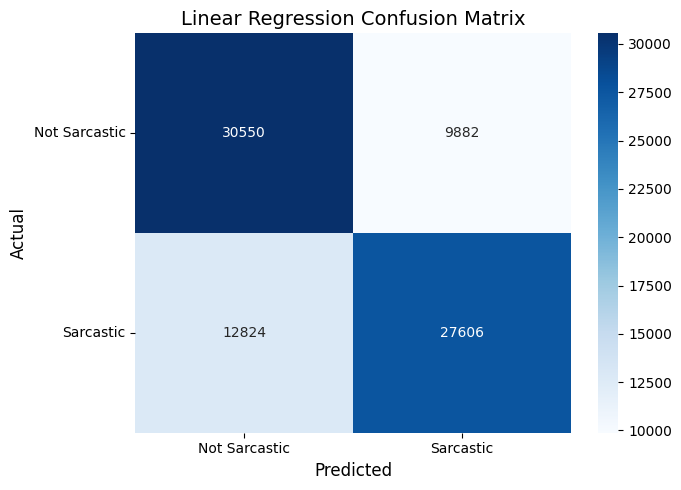
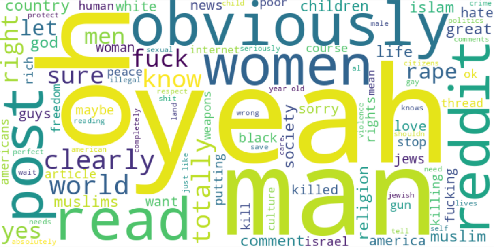
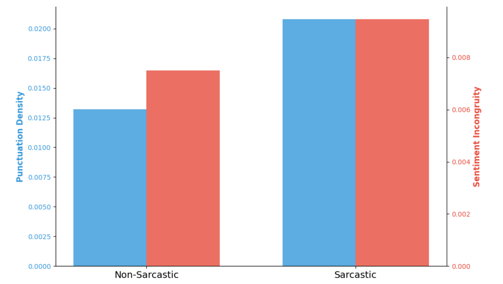

# Beyond the Literal: Unmasking Sarcasm’s Signature on Reddit

Group members: Emrecan Ulu; Flora Hirche

## Introduction

Differentiating between the literal and the intended meaning of a text remains a challenging task in Natural Language Processing. This so-called word sense disambiguation (WSD) problem (Chen et al., 2024) can affect the quality of sentiment analysis by concealing the actual attitudes and opinions of the author. **The goal of this project is to automatically detect sarcasm in our Reddit dataset, identify typical characteristics of sarcasm, and explore the topics that sarcastic comments focus on.**

Website URL: https://flora515.github.io/sarcasm-project-report/index.html

[Open the Topic Modeling Dashboard](plots/index.html)

## Dataset

For fine-tuning a sarcasm detector, we used data that was gathered by Khodak et al. (2017) for their paper ["A Large Self-Annotated Corpus for Sarcasm"](https://arxiv.org/abs/1704.05579). It contains a balanced number of labeled sarcastic and non-sarcastic comments, containing a total of 1,010,826 entries. The labels were retrieved from Reddit users annotating their sarcastic comments with "/s". The dataset, specifically the 'train-balanced-sarcasm.csv' file we worked with, can be accessed [here](https://www.kaggle.com/datasets/danofer/sarcasm/data) on Kaggle.

We detected and analyzed sarcasm in the [Webis-TLDR-17 dataset](https://huggingface.co/datasets/webis/tldr-17). It contains 3,848,330 preprocessed Reddit posts, including their author, subreddit and self-annotated "too long; didn't read" (TLDR) summaries. The dataset was created using the authors' "tl;dr" annotations to obtain labels for automatic summarization training. A more detailed description can be found in [this paper](https://aclanthology.org/W17-4508.pdf) by Völske et al. (2017).

## Methods

We fine-tuned the RoBERTa model (for sequence classification) on sarcasm detection, using the labeled training dataset. In order to evaluate its performance, we compared the fine-tuned model to a linear regression model that was trained on the same data and on the same task. We applied TF-IDF vectorization to find the most characteristic expressions that were used in the sarcastic comments compared to the non-sarcastic ones. In our linguistic analysis, we determined the sentiment incongruity and punctuation density of sarcastic and non-sarcastic comments. Finally, we applied topic modeling to the comments labeled as sarcastic. 

### Setup 

- Outline the tools, software, and hardware environment, along with configurations used for conducting your experiments
- Be sure to document the Python version and other dependencies clearly
- Provide step-by-step instructions on how to recreate your environment, ensuring anyone can replicate your setup with ease:

```bash
conda create --name myenv python=<version>
conda activate myenv
```

Include a `requirements.txt` file in your project repository. This file should list all the Python libraries and their versions needed to run the project. Provide instructions on how to install these dependencies using pip, for example:

```bash
pip install -r requirements.txt
```

### Experiments

- preprocessing: describe  data cleaning, normalization/transformation steps you applied to prepare the dataset, along with the reasons for choosing these methods
- model training: explain the methodologies and algorithms you used, detail the parameter settings and training protocols, and describe measures taken to ensure the validity of the model

#### Preprocessing Labeled Sarcasm Data

In preparation for the fine-tuning, we transformed the CSV file into a Pandas DataFrame and removed empty comments and unnecessary comlumns. We seperated 20% of the data for testing and split the remaining data into training and validation datasets (10% of the 80% were used for validation, the rest for training). Then, we transformed training, validation and test set into the HuggingFace dataset format and tokenized them using the Tokenizer from the pretrained RoBERTa model.

#### Model Fine-Tuning

The pretrained RoBERTa (for sequence classification) model served as our base model for fine-tuning it on sarcasm detection. In our training parameters, we specified a learning rate of 1e-5, 2 epochs
...
- explain choice of parameters
- measures to ensure validity of the model

As a benchmark for our fine-tuned model's performance, we used the evaluation metrics of a linear regression model that was trained on the same data. This model was trained within the [Open Machine Learning Course](https://mlcourse.ai/book/index.html) by Yury Kashnitsky and can be found in [this Kaggle notebook](https://www.kaggle.com/code/kashnitsky/a4-demo-sarcasm-detection-with-logit).

#### Preprocessing for Sarcasm Detection

To prepare the Webis-TLDR-17 dataset for detecting sarcasm, we transformed it into a Pandas DataFrame and selected three subreddits out of the top 20 subreddits containing the most comments. To be able to analyze sarcasm in diverse contexts and styles, we chose one subreddit from each category:

1. **humor-oriented** - We chose the subreddit 'r/WTF', in which we expected a high rate of sarcasm, primarily in the context of personal stories. (The bigger subreddit 'r/funny' contained more posts than we were able to process.)
2. **political/debate-oriented** - We chose 'r/worldnews', in which we expected a high rate of sarcasm, to capture sarcasm on political and controversial topics.
3. **informational/explanatory** - We chose 'r/explainlikeimfive' as a subreddit in which we expected a diverse range of topics and a lower rate of sarcasm compared to the other selected subreddits.

We cleaned the pre-selected data by removing duplicate comments within the same subreddit, empty comments and columns that we wouldn't need in our analyses (body, normalized body). Then we transformed the cleaned dataframe into the HuggingFace format and tokenized it by applying the RoBERTa tokenizer.

#### Linguistic Analysis

We used TF-IDF vectorization and 1- and 2-grams to find characteristic expressions in the comments that were labeled sarcastic in comparison to the non-sarcastic comments. To calculate the sentiment incongruity of sarcastic and non-sarcastic comments, we obtained polarity scores by applying the Vader Sentiment Analyzer and multiplying the positive with the negative score for each comment. We calculated the emphatic punctuation density by normalizing the sum of punctuation characters ('!', '?', '""') in each comment by its word count.

#### Topic Modeling

Before topic modeling, we filtered the dataset to include only the comments that were labeled as sarcastic. We reduced this dataframe to the "comment" column and removed stopwords from it. Then, we used BERTopic to perform the text embedding, dimensionality reduction (using UMAP) and clustering with HDBSCAN (Hierarchical Density-Based Spatial Clustering of Applications with Noise).

## Results and Discussion

- Present the findings from your experiments, supported by visual or statistical evidence
- Discuss how these results address your main research question.

### Sarcasm Detection

- plot: metrics table



The evaluation of the fine-tuned model suggests that it performs better than a simpler linear regression model, while maintaing a balance between precision and recall. Still, it produces a significant amount of misclassifiations. First, we tested classifying both, the TLDRs and full posts in the Webis-TLDR-17 data. As shown in figure xxx, we found a higher rate of sarcasm when we classified the TLDRs compared to when we classified the full comments.


After inspecting the results of both, we suspected an overclassification of sarcasm in the TLDRs and decided to keep results for the full posts. The model classified xxx comments as sarcastic and xxx as non-sarcastic.

### Analysis of Sarcasm in Webis-TLDR-17

The expression that were characteristic for the sarcastic compared to the non-sarcastic comments are visualized in figure xxx.



We found lower rates of sentiment incongruity and emphatic punctuation in "r/explainlikeimfive" than in "r/worldnews" and in "r/WTF", aligning with our expectations about the sarcasm rates selecting these subreddits. 

- plot: rates of sarcasm across subreddits

In the sarcastic comments, we found a higher mean sentiment incongruity score and a higher mean emphatic punctuation density compared to the non-sarcastic comments. These results indicate that the classification worked well enough to find expected differences in two main characteristics of sarcastic texts.



The results of the topic modeling are visualized on dashboard here: [Open the Topic Modeling Dashboard](plots/index.html) 

## Conclusion

- Summarize the major outcomes of your project
- reflect on the research findings
- clearly state the conclusions you've drawn from the study.


## Contributions

| Team Member  | Contributions                                                             |
|--------------|---------------------------------------------------------------------------|
| Emrecan Ulu  | topic modeling (code and dashboard)                                       |
| Flora Hirche | preprocessing, model fine-tuning & evaluation, linguistic analysis        |

## References

Chen, W., Lin, F., Li, G., & Liu, B. (2024). A survey of automatic sarcasm detection: Fundamental theories, formulation, datasets, detection methods, and opportunities. Neurocomputing. https://doi.org/10.1016/j.neucom.2024.127428

Joshi, A., Joshi, A., Bhattacharyya, P., Bhattacharyya, P., Carman, M. J., & Carman, M. J. (2017). Automatic Sarcasm Detection: A Survey. ACM Computing Surveys. https://doi.org/10.1145/3124420

Khodak, M., Khodak, M., Saunshi, N., Saunshi, N., Vodrahalli, K., & Vodrahalli, K. (2017). A Large Self-Annotated Corpus for Sarcasm. arXiv: Computation and Language. https://doi.org/null

Völske, M., Völske, M., Potthast, M., Potthast, M., Syed, S., Syed, S., Stein, B., & Stein, B. (2017). TL;DR: Mining Reddit to Learn Automatic Summarization. NFiS@EMNLP. https://doi.org/10.18653/v1/w17-4508


