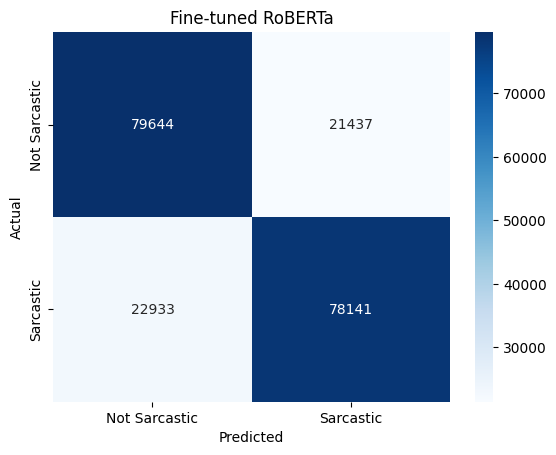
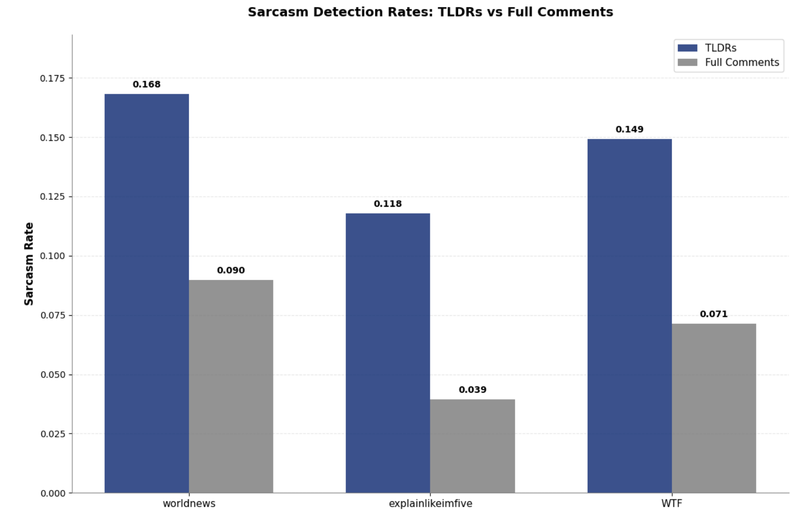
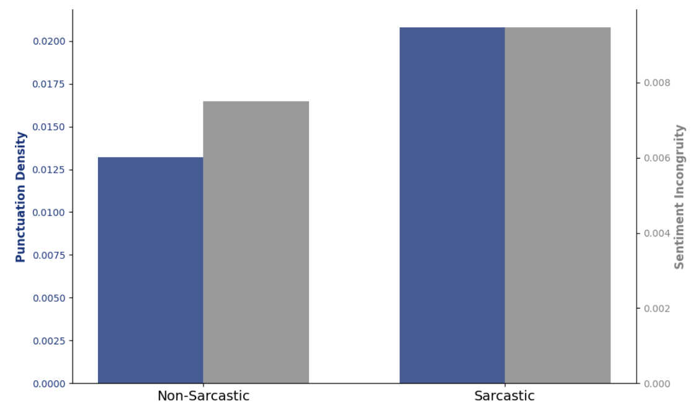
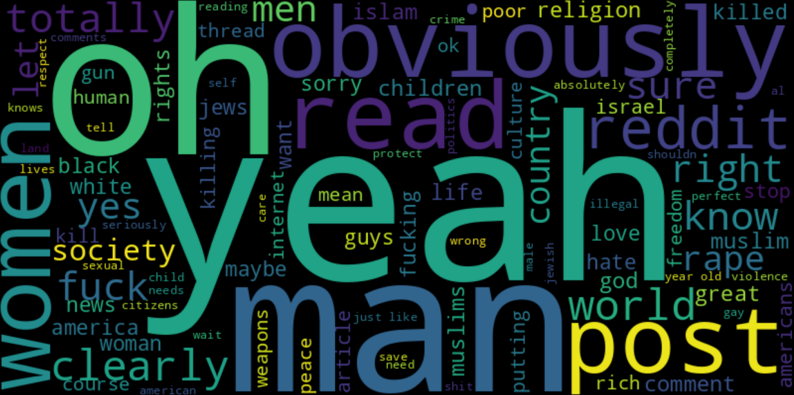

# Beyond the Literal: Unmasking Sarcasm’s Signature on Reddit

Group members: *Emrecan Ulu*; *Flora Hirche*


Sarcasm presents a challenging computational task, due to the inherent discrepancy between its literal expression and intended implication, known as the word sense disambiguation (WSD) problem (Chen et al., 2024). The accurate detection of sarcasm is crucial for various Natural Language Processing (NLP) applications, including sentiment analysis, as well as opinion mining and broader understanding of social media discourse.

- granularity/context

Our goal with this project is to develop a robust sarcasm detection model, to identify essential linguistic characteristics of sarcasm, and explore the topics that sarcasm on Reddit tends to focus on.

## Dataset

For fine-tuning a sarcasm detector, we used data that was gathered by Khodak et al. (2017) for their paper ["A Large Self-Annotated Corpus for Sarcasm"](https://arxiv.org/abs/1704.05579). It contains a balanced number of labeled sarcastic and non-sarcastic comments, containing a total of 1,010,826 entries. The labels were retrieved from Reddit users annotating their sarcastic comments with "\s". The dataset, specifically the 'train-balanced-sarcasm.csv' file we worked with, can be accessed [here](https://www.kaggle.com/datasets/danofer/sarcasm/data) on Kaggle.

We detected and analyzed sarcasm in the [Webis-TLDR-17 dataset](https://huggingface.co/datasets/webis/tldr-17). It contains 3,848,330 preprocessed Reddit posts, including their author, subreddit and self-annotated "too long; didn't read" (TLDR) summaries. The dataset was created using the authors' "tl;dr" annotations to obtain labels for automatic summarization training. A more detailed description can be found in [this paper](https://aclanthology.org/W17-4508.pdf) by Völske et al. (2017).

## Method

### Setup 

```bash
conda create --name myenv python=3.10
conda activate myenv
```

Install CUDA-compatible Torch manually from [PyTorch Website](https://pytorch.org). Related notebooks and dependencies can be found in the [code directory](https://github.com/flora515/sarcasm-project-report/tree/main/code).

```bash
pip install -r requirements.txt
```

### Experiments

We fine-tuned the RoBERTa model (for sequence classification) on sarcasm detection, using the labeled training dataset. In order to evaluate its performance, we compared the fine-tuned model to a linear regression model that was trained on the same data and on the same task. We applied TF-IDF vectorization to find the most characteristic expressions that were used in the sarcastic comments compared to the non-sarcastic ones. In our linguistic analysis, we determined the sentiment incongruity and punctuation density of sarcastic and non-sarcastic comments. Finally, we applied topic modeling to the comments labeled as sarcastic. 

#### Preprocessing Labeled Sarcasm Data

In preparation for the fine-tuning, we transformed the CSV file into a Pandas DataFrame and removed empty comments and unnecessary comlumns. We seperated 20% of the data for testing and split the remaining data into training and validation datasets (10% of the 80% were used for validation, the rest for training). Then, we transformed training, validation and test set into the HuggingFace dataset format and tokenized them using the Tokenizer from the pretrained RoBERTa model.

#### Model Fine-Tuning

The pretrained RoBERTa (for sequence classification) model served as our base model for the fine-tuning on sarcasm detection. We enabled Mixed-precision training (using 16-bit fp) to reduce memory consumption and speed up the training time. This was crucial for efficiently fine-tuning RoBERTa on the available computational resources. We added a weight decay parameter of 0.01 to reduce the likelihood of overfitting to noise in the training data. We specified a relatively small learning rate of 1e-5 which ensured that the pre-trained weights were adjusted incrementally to adapt to the sarcasm detection task. We found two epochs to be sufficient for convergence without significant overfitting on the validation set.

As a baseline for our fine-tuned model's performance, we used the evaluation metrics of a logistic regression model that was trained on the same data. This model was trained within the [Open Machine Learning Course](https://mlcourse.ai/book/index.html) by Yury Kashnitsky and can be found in [this Kaggle notebook](https://www.kaggle.com/code/kashnitsky/a4-demo-sarcasm-detection-with-logit).

#### Preprocessing for Sarcasm Detection

To prepare the Webis-TLDR-17 dataset for detecting sarcasm, we transformed it into a Pandas DataFrame and selected three subreddits out of the top 20 subreddits containing the most comments. To be able to analyze sarcasm in diverse contexts and styles, we chose one subreddit from each category:

1. **humor-oriented** - We chose the subreddit 'r/WTF', in which we expected a high rate of sarcasm, primarily in the context of personal stories. (The bigger subreddit 'r/funny' contained more posts than we were able to process.)
2. **political/debate-oriented** - We chose 'r/worldnews', in which we expected a high rate of sarcasm, to capture sarcasm on political and controversial topics.
3. **informational/explanatory** - We chose 'r/explainlikeimfive' as a subreddit in which we expected a diverse range of topics and a lower rate of sarcasm compared to the other selected subreddits.

We cleaned the pre-selected data by removing duplicate comments within the same subreddit, empty comments and columns that we wouldn't need in our analyses (body, normalized body). Then we transformed the cleaned dataframe into the HuggingFace format and tokenized it by applying the RoBERTa tokenizer.

#### Linguistic Analysis

We used TF-IDF vectorization and 1- and 2-grams to find characteristic expressions in the comments that were labeled sarcastic in comparison to the non-sarcastic comments. To calculate the sentiment incongruity of sarcastic and non-sarcastic comments, we obtained polarity scores by applying the Vader Sentiment Analyzer and multiplied the positive with the negative score for each comment. We calculated the emphatic punctuation density by normalizing the sum of punctuation characters ('!', '?', '""') in each comment by its word count.

#### Topic Modeling

Before topic modeling, we filtered the dataset to include only the comments that were labeled as sarcastic. We reduced this dataframe to the "comment" column and removed stopwords from it. Then, we used BERTopic to perform the text embedding, dimensionality reduction (using UMAP) and clustering with HDBSCAN (Hierarchical Density-Based Spatial Clustering of Applications with Noise).

## Results and Discussion



<table style="border-collapse: collapse; font-family: sans-serif;">
  <thead>
    <tr style="background-color: #f0f0f0;">
      <th colspan="4">Logistic Regression</th>
      <th style="border-left: 5px solid black;"></th>
      <th colspan="4">Fine-tuned RoBERTa</th>
    </tr>
    <tr>
      <th>Class</th><th>Precision</th><th>Recall</th><th>F1-Score</th>
      <th style="border-left: 5px solid black;"></th>
      <th>Class</th><th>Precision</th><th>Recall</th><th>F1-Score</th>
    </tr>
  </thead>
  <tbody>
    <tr>
      <td>Not Sarcastic</td><td>0.74</td><td>0.68</td><td>0.71</td>
      <td style="border-left: 5px solid black;"></td>
      <td>Not Sarcastic</td><td>0.78</td><td>0.79</td><td>0.78</td>
    </tr>
    <tr>
      <td>Sarcastic</td><td>0.74</td><td>0.68</td><td>0.71</td>
      <td style="border-left: 5px solid black;"></td>
      <td>Sarcastic</td><td>0.78</td><td>0.77</td><td>0.78</td>
    </tr>
    <tr>
      <td>Accuracy</td><td colspan="3">0.72</td>
      <td style="border-left: 5px solid black;"></td>
      <td>Accuracy</td><td colspan="3">0.78</td>
    </tr>
  </tbody>
</table>

You can download and load the fine-tuned RoBERTa model from the Hugging Face Hub: [loahi25/roberta-finetuned-sarc2](https://huggingface.co/loahi25/roberta-finetuned-sarc2)

The fine-tuned RoBERTa model achieved an overall accuracy of 78% on the validation set, which demonstrates a robust capability in distinguishing between sarcastic and non-sarcastic Reddit comments. Compared to the logistic regression results, the fine-tuned model showed a 6% higher accuracy, while having balanced precision and recall scores. The balanced F1-scores across sarcastic and non-sarcastic comments (0.78 for both) suggest that the model performs consistently well for both classes, without a significant bias towards one class. Despite high performance, both models yield a non-negligible rate of misclassification. This implies a need for more context information like user- or conversation-specific details and potentially multi-modal information like images or other media that the comments are referring to.




*Sarcasm Detection in Webis-TLDR-17*

As shown by the figure above, we found higher rates of sarcasm when we classified sarcasm in the TLDRs compared to when we classified the full comments. After inspecting and comparing the results, we suspected an overclassification of sarcasm in the TLDRs and decided to keep results for the full posts. The model classified 4,783 comments out of 72,619 comments (6.6%) as sarcastic.

In alignment with our expectations, "explainlikeimfive" showed a lower rate of sarcasm than "WTF" and "worldnews". The differences in sarcasm rates across subreddits confirm that sarcasm is context-dependent.

*Sentiment Incongruity and Emphatic Punctuation*



In the sarcastic comments, we found a higher mean sentiment incongruity score and a higher mean emphatic punctuation density compared to the non-sarcastic comments. These results indicate that the classification worked well enough to find expected differences in two main characteristics of sarcastic texts.

These were characteristic expressions for the sarcastic comments in the dataset:



The results of the topic modeling are visualized on [this dashboard](plots/index.html).

## Conclusion

Our project successfully fine-tuned a RoBERTa-based model to detect sarcasm in Reddit posts, outperforming a traditional logistic regression approach. Through our linguistic and computational analysis, we identified key features of sarcastic language, such as sentiment incongruity and emphatic punctuation, that support the model’s predictions. Topic modeling revealed that sarcastic comments tend to concentrate around controversial, humorous, and emotionally charged themes. These results underscore the multifaceted nature of sarcasm and the importance of context-aware modeling in NLP tasks.


## Contributions

| Team Member  | Contributions                                                             |
|--------------|---------------------------------------------------------------------------|
| Emrecan Ulu  | topic modeling (code and dashboard)                                       |
| Flora Hirche | preprocessing, model fine-tuning & evaluation, linguistic analysis        |

## References

Chen, W., Lin, F., Li, G., & Liu, B. (2024). A survey of automatic sarcasm detection: Fundamental theories, formulation, datasets, detection methods, and opportunities. Neurocomputing. https://doi.org/10.1016/j.neucom.2024.127428

Joshi, A., Joshi, A., Bhattacharyya, P., Bhattacharyya, P., Carman, M. J., & Carman, M. J. (2017). Automatic Sarcasm Detection: A Survey. ACM Computing Surveys. https://doi.org/10.1145/3124420

Khodak, M., Khodak, M., Saunshi, N., Saunshi, N., Vodrahalli, K., & Vodrahalli, K. (2017). A Large Self-Annotated Corpus for Sarcasm. arXiv: Computation and Language. https://doi.org/null

Völske, M., Völske, M., Potthast, M., Potthast, M., Syed, S., Syed, S., Stein, B., & Stein, B. (2017). TL;DR: Mining Reddit to Learn Automatic Summarization. NFiS@EMNLP. https://doi.org/10.18653/v1/w17-4508


